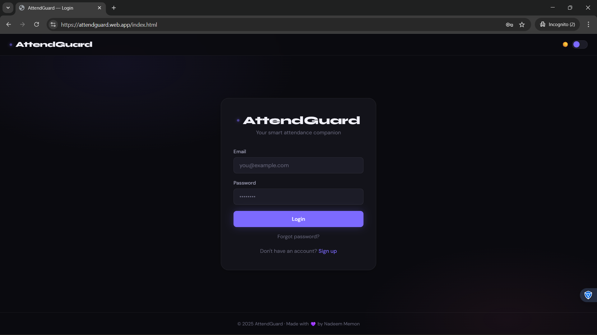
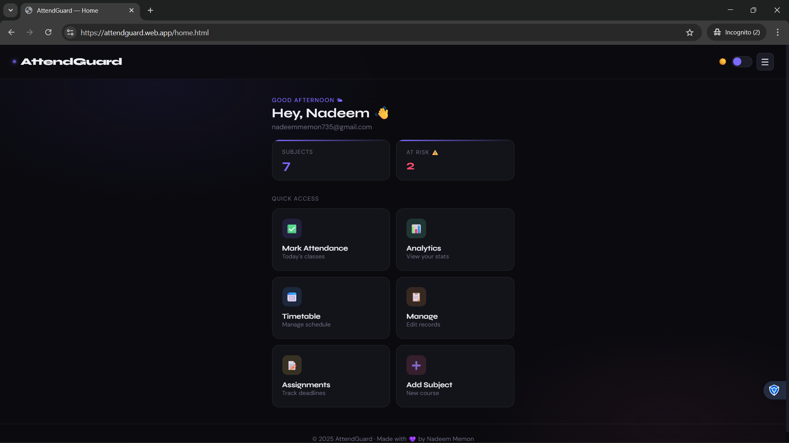
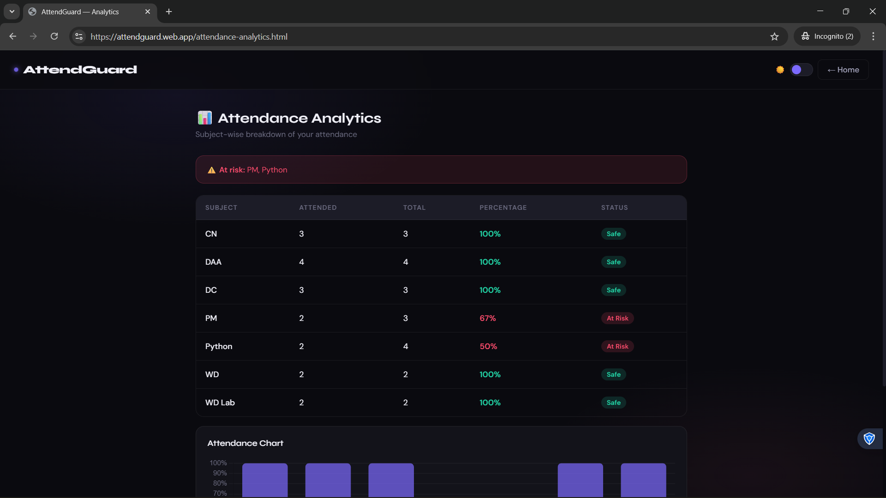
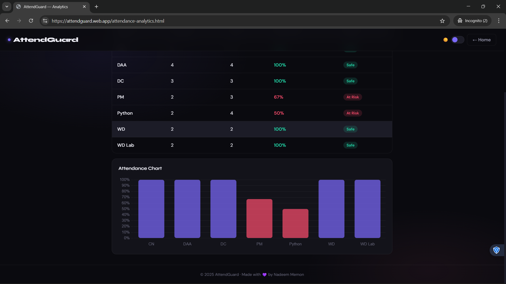
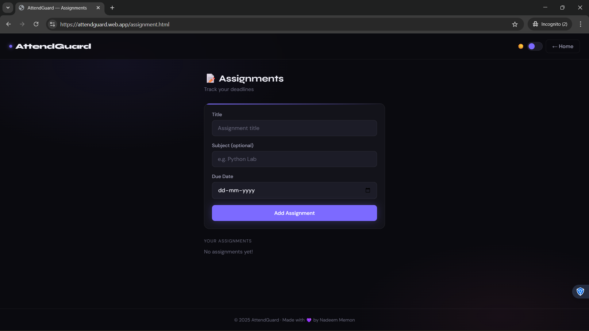

# AttendGuard 🛡️
### Your Smart Attendance Companion

> Built out of frustration with manually tracking attendance — and then actually used by real college friends.

[](https://attendguard.web.app)
[](https://firebase.google.com)
[](https://developer.mozilla.org/en-US/docs/Web/JavaScript)
[](https://tailwindcss.com)

---

## 🚀 Live Demo

**[attendguard.web.app](https://attendguard.web.app)**

---

## 📖 The Story

Every semester, the same problem — manually counting lectures, guessing if you can bunk, panicking before exams. I built AttendGuard to solve this for myself, shared it with friends, and before long they were actually using it daily.

Then one day I tried adding an assignment feature and the whole app broke. Auth stopped working, layout fell apart. Spent days debugging, fixed it, redeployed — and now it's better than ever.

---

## ✨ Features

- 🔐 **Authentication** — Email/password login with Firebase Auth, forgot password support
- ➕ **Subject Management** — Add and remove your subjects
- 📅 **Timetable** — Set up your weekly schedule (day + subject + time)
- ✅ **Mark Attendance** — Auto-loads today's subjects from timetable, mark Present / Absent / Mass Bunk / Cancelled
- 📊 **Attendance Analytics** — Subject-wise % with color-coded bar chart (red = below 75%)
- 📋 **Manage Attendance** — Calendar view to edit past attendance records
- 📝 **Assignments** — Add assignments with due dates, mark as done, overdue detection
- 👤 **Profile** — Custom display name + avatar selector
- 🌙 **Dark / Light Mode** — Persistent theme toggle across all pages
- 📱 **Mobile First** — Designed for phone use, works on desktop too

---

## 🛠️ Tech Stack

| Layer | Technology |
|---|---|
| Frontend | HTML, CSS, Vanilla JavaScript |
| Styling | Custom CSS Design System + Tailwind CSS |
| Auth | Firebase Authentication |
| Database | Firebase Realtime Database |
| Hosting | Firebase Hosting |
| Charts | Chart.js |

---

## 🗂️ Project Structure

```
AttendGuard/
├── index.html               # Login page
├── sign-up.html             # Sign up page
├── home.html                # Dashboard
├── add-subject.html         # Manage subjects
├── time-table.html          # Weekly timetable
├── attendance.html          # Mark today's attendance
├── attendance-analytics.html # Charts & stats
├── manage-attendance.html   # Calendar-based editor
├── assignment.html          # Assignment tracker
├── Profile.html             # User profile
├── styles.css               # Shared design system
├── theme.js                 # Dark/light toggle logic
├── firebase-config.js       # Firebase initialization
└── images/avatars/          # Avatar options
```

---

## 🗄️ Firebase Database Structure

```
users/
  {uid}/
    subjects/          → Subject list
    timetable/         → Weekly schedule entries
    attendance/        → Per-subject attended/total counts
    attendanceLog/     → Date-wise attendance records
    assignments/       → Assignment entries
```

---

## ⚙️ Getting Started

### 1. Clone the repo
```bash
git clone https://github.com/nadeem12-cloud/AttendGuard.git
cd AttendGuard
```

### 2. Set up Firebase
- Create a project at [console.firebase.google.com](https://console.firebase.google.com)
- Enable **Authentication** (Email/Password)
- Enable **Realtime Database**
- Copy your config into `firebase-config.js`

### 3. Set Firebase Rules
In Realtime Database → Rules:
```json
{
  "rules": {
    "users": {
      "$uid": {
        ".read": "$uid === auth.uid",
        ".write": "$uid === auth.uid"
      }
    }
  }
}
```

### 4. Run locally
```bash
npm install -g firebase-tools
firebase login
firebase serve
```
Open `http://localhost:5000`

### 5. Deploy
```bash
firebase deploy
```

---

## 📱 Screenshots







---

## 🔮 Future Plans

- [ ] Push notifications for assignment deadlines
- [ ] Bunk calculator — "how many more can I miss?"
- [ ] Export attendance report as PDF
- [ ] PWA support — install as mobile app
- [ ] Batch / semester overview

---

## 👤 Author

**Mohammad Nadeem Memon**
- GitHub: [@nadeem12-cloud](https://github.com/nadeem12-cloud)
- LinkedIn: [linkedin.com/in/nadeem-memon-22b557229](https://linkedin.com/in/nadeem-memon-22b557229)
- Live: [attendguard.web.app](https://attendguard.web.app)

---

> *"Built it, broke it, fixed it, shipped it — that's real development."*

---

⭐ If this helped you, give it a star!
